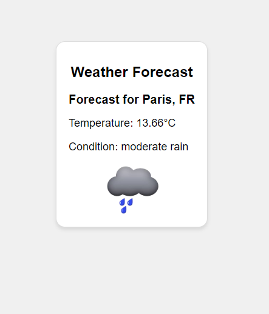

# Weather Forecast Website

 

## What is this project?

The Weather Forecast Website is a simple website that provides weather forecasts for anywhere in the world. With this website, you can check the current weather conditions for any city.

## How it works?

Is easy! Just enter the name of the city you want to check in the search field and click "Get Forecast". The site will use a reliable data source to fetch weather information, and in a matter of seconds, you will have access to detailed information, including the current temperature, weather conditions, and a representative image of the situation.

## Tools Used

- **Node.js and Express.js**: To create the web server and manage the routes.
- EJS (Embedded JavaScript Templates): A templating language that allows dynamic creation of HTML pages.
- HTML and SCSS: For the structure and style of the pages.
- OpenWeatherMap API: A third-party API that provides accurate and up-to-date weather information.
- Axios: A library for making HTTP requests.